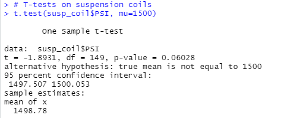

# Overview of the Project

AutosRUs’ newest prototype, the MechaCar, is suffering from production troubles that are blocking the manufacturing team’s progress. The data
analytics team has been called to review the production data for insights that may help the manufacturing team. The data analytics team is to
perform the below:

- Perform multiple linear regression analysis to identify which variables in the dataset predict the mpg of MechaCar prototypes
- Collect summary statistics on the pounds per square inch (PSI) of the suspension coils from the manufacturing lots
- Run t-tests to determine if the manufacturing lots are statistically different from the mean population
- Design a statistical study to compare vehicle performance of the MechaCar vehicles against vehicles from other manufacturers. 

## Linear Regression to Predict MPG

- **Which variables/coefficients provided a non-random amount of variance to the mpg values in the dataset?**
   
	
	
	Variables/coefficients in our dataset which show a non-random effect on the MPG of the MechaCar are the Vehicle Length with p-value of 
	2.6x10-12 and the Ground Clearance with p-value of 5.21x10-8. This means that these variables have significant impact on MPG.
	
	The intercept is also significant which idicates there are other factors that are not included in the dataset.
	
- **Is the slope of the linear model considered to be zero? Why or why not?**
   
   The slope of the linear model is not considered to be zeros as the p-value of 5.35x10-11 is lower than the significant level of 0.05%. 
   This clearly indicates that the null hypothesis must be rejected.

- **Does this linear model predict mpg of MechaCar prototypes effectively? Why or why not?**

   This linear model predict mpg of MechaCar prototypes is relatively effective. The  r-squared value of 0.7149 indicates that the model is 
   71% accurate.
   
## Summary Statistics on Suspension Coils

   The design specifications for the MechaCar suspension coils dictate that the variance of the suspension coils must not exceed 100 pounds 
   per square inch.
	
 **Does the current manufacturing data meet this design specification for all manufacturing lots in total and each lot individually? Why or** 
 **why not?**

### Total Summary

The variance of the suspension coils in the total summary is 62.29, which is below 100 and therefore meets the MechaCar design 
specifications.
   
### Lot Summary

In the lot summary, Lot1 and Lot2 meets the design speciafication, but the variance of Lot3 is above the acceptable level of 100, therefore
it fails to meet the MechaCar design specifications.
	
## T-Tests on Suspension Coils

A t-test is performed to see if the PSI across all manufacturing lots is statistically different from the population mean of 1,500 pounds 
per square inch.

	
  
- The t-test result reveal that the PSI across all manufacturing lots is not statistically different from the population mean. The dataset is
   considered to be normally distributed as the p-value of 0.06028 is above the significance level of 0.05 percent, therefore we cannot reject 
   the null hypothesis.
 
	
 
- The results of the T-test for the suspension coils for Lot1 are not statistically different from the population mean. The p-value is 1, which
   is above the significance level of 0.05 percent, therefore we cannot reject the null hypothesis.
 
	
 
- The results of the T-test for the suspension coils for Lot2 are not statistically different from the population mean. The p-value is 0.6072, 
   which is above the significance level of 0.05 percent, therefore we cannot reject the null hypothesis.
 
	
 
- The results of the T-test for the suspension coils for Lot3 are statistically different from the population mean. The p-value is 0.04168, 
   which is below the significance level of 0.05 percent, therefore we cannot reject the null hypothesis.
 
## Study Design: MechaCar vs Competition

In order to study MechaCar's performance with the competion, the below points are to be considered for the analysis:

- What metric or metrics are you going to test?
  The metric I am going to test is the maintaince cost.

- What is the null hypothesis or alternative hypothesis?
  - Null hypothesis: the maintaince cost of MechaCar vehicles is same as that of its competitors
  - Alternate hypothesis: the maintaince cost of MechaCar vehicles is not same as that of its competitors
  
- What statistical test would you use to test the hypothesis? And why?
  I will be using the two-sample t-test to test this hypothesis.

- What data is needed to run the statistical test?
  We need the data of the maintaince cost of MechaCar prototypes and also of the major competitors.

 